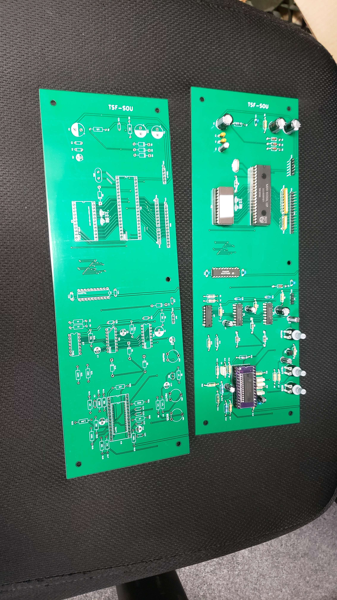
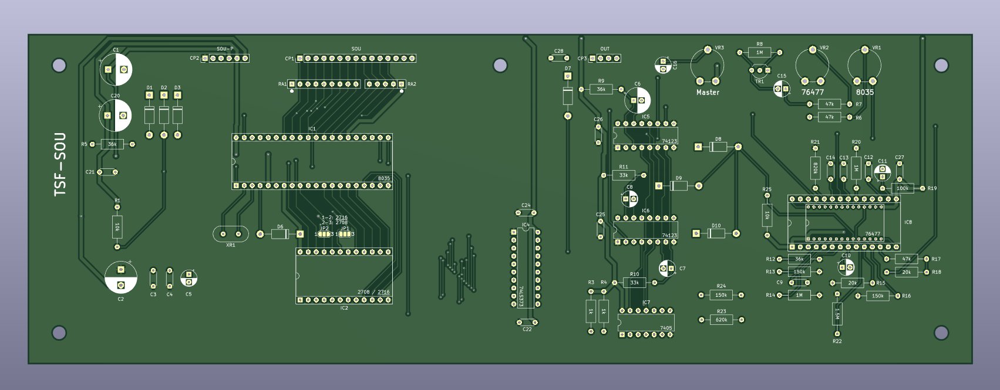
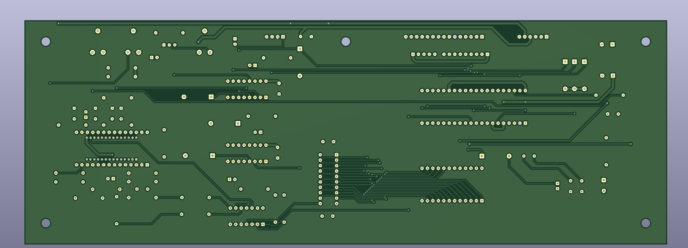

# TSF-SOU
Reproduction of the TSF-SOU sound pcb. **This board is currently untested, will update when fully tested.** The rest of the documentation will be added when I fully test. Use at your own risk.

## Notes
There were a few changes that were made to make this board cheaper/easier to make
- both 76477 footprints are onboard
- IC3 and IC4 combined with one 74LS373
- Jumpers added to switch between 2708 and single voltage rail 2716 EPROMs, strapped for single voltage rail 2716 by default.
## Board Picture

## Board Renders
### Front of the board

### Back of the board

